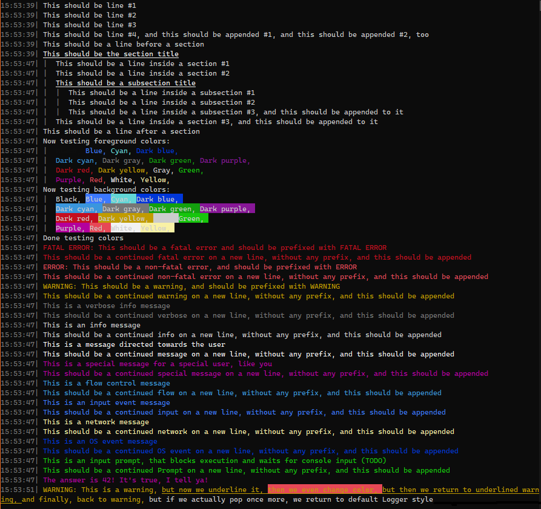
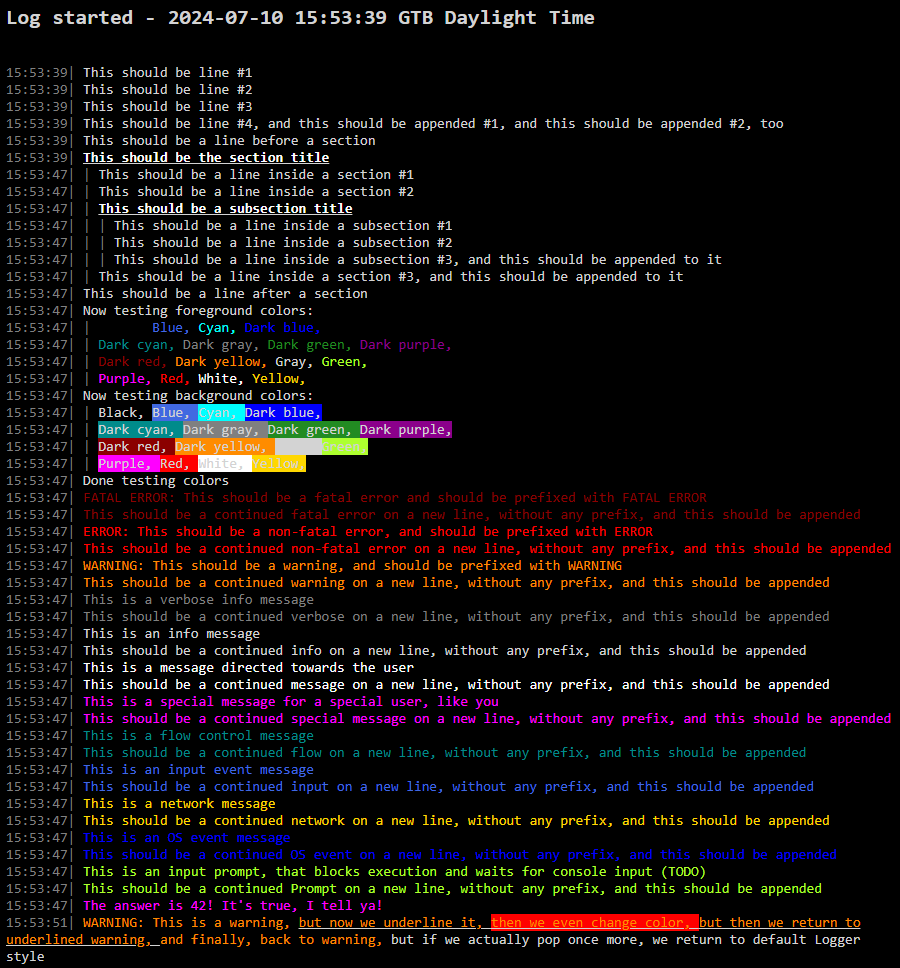

[](https://github.com/Langulus/Logger/actions/workflows/ci.yml)
# Langulus::Logger
`Langulus::Logger` is a stateful C++23 logger library based on [{fmt} library](https://github.com/fmtlib/fmt), capable of logging to a console and/or and HTML file. It is used in [all other Langulus](https://github.com/Langulus) libraries and plug-ins.
It contains about a dozen highly-inlined variadic functions with different styles for a consistently pretty and easy logging experience.

This is how it looks in Windows 10 Terminal:


This is how it looks when logging to a HTML file (Chrome web browser):


# Getting the library
If you have CMake 3.28+, the easiest way to get this library is to use `FetchContent` in your `CMakeLists.txt`, like so:
```cmake
include(FetchContent)
FetchContent_Declare(LangulusLogger
   GIT_REPOSITORY   https://github.com/Langulus/Logger.git
   GIT_TAG          main    # you should use a specific commit/release, so that you can control when to bump your dependencies
   EXCLUDE_FROM_ALL
)
FetchContent_MakeAvailable(LangulusLogger)
```
Then just link to your target to get all the include directories:
```cmake
target_link_libraries(YourLibrary PUBLIC LangulusLogger)
```
This will also automatically fetch all dependencies - [{fmt}](https://github.com/fmtlib/fmt) and [Langulus::Core](https://github.com/Langulus/Core).

---------------
Alternatively, you can just download and copy the files from `source/` to your build tree, but you will also have to download and copy the dependencies, too. Don't forget to add `Logger.cpp` to your target.

# Using the library
After linking with LangulusLogger, you can include it in your files, and call the required functions, which are located in the `Langulus::Logger` namespace:
```c++
#include <Logger/Logger.hpp>
using namespace Langulus;

int main(int argc, char* argv[]) {
   Logger::Info("Hello, world!");
   return 0;
}
```
Visit the Wiki for a full list of the [available functions](https://github.com/Langulus/Logger/wiki/API) and [customization points](https://github.com/Langulus/Logger/wiki/Customization-points).

# Considerations
Langulus::Logger's API is unlikely to change drastically - only a couple of additonal features remain to be added.

# Community feedback
I would love feedback and suggestions, please feel free to join the [forum](https://github.com/Langulus/Logger/discussions).
However it should be stated clearly, that Langulus is primarily a personal project that I've been developing for over 10 years, and is aiming primarily at satisfying my requirements.
As such, ideas and suggestions may not be necessarily implemented by [me](https://github.com/Epixu), unless I find them exceedingly useful.
If you really need me to add or improve something that isn't on my daily agenda, you should consider sponsoring me.
